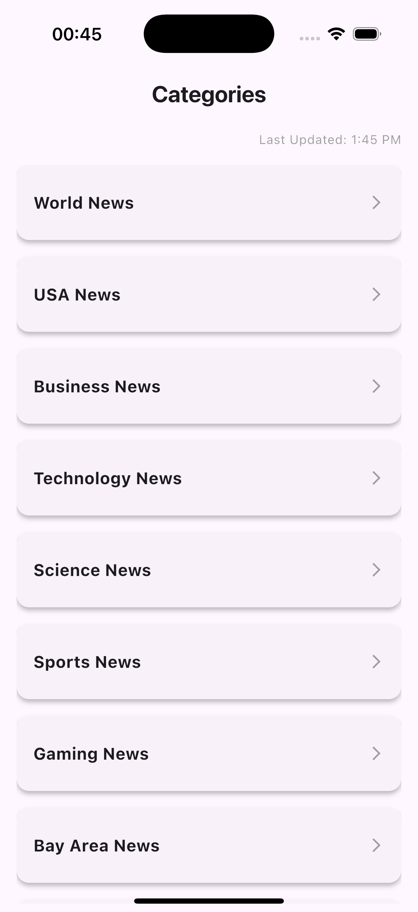
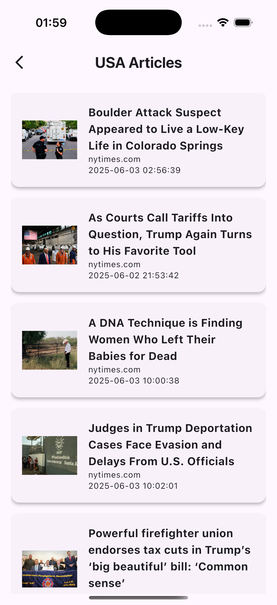

# Kagi Demo

A Flutter application demonstrating the use of **Bloc architecture**, **Freezed models**, and **clean UI/UX principles**. This project showcases best practices in Flutter development, including state management, API integration, and modular design.

---

## Features

- **Category Management**
  - Fetches and displays a list of categories from an API.
  - Handles loading, success, and error states.

- **Articles Management**
  - Displays articles for a selected category.
  - Handles image loading with graceful fallbacks.
  - Supports navigation to detailed article pages.

- **State Management**
  - Uses `flutter_bloc` for predictable state handling.
  - Custom `BlocObserver` logs events, transitions, and errors for debugging.

- **UI/UX**
  - Clean, modern design with consistent typography and spacing.
  - Responsive layout for multiple screen sizes.
  - Error states with retry options.

---

## Screenshots

<table>
  <tr>
    <td align="center">Categories Screen</td>
    <td>&nbsp;&nbsp;&nbsp;</td>
    <td align="center">Articles List</td>
    <td>&nbsp;&nbsp;&nbsp;</td>
    <td align="center">Article Detail</td>
  </tr>
  <tr>
    <td></td>
    <td>&nbsp;</td>
    <td></td>
    <td>&nbsp;</td>
    <td></td>
  </tr>
</table>

---

## Demo Video

<table>
  <tr>
    <td align="center">
      <a href="assets/videos/demo_video.mp4">
        
      </a>
    </td>
  </tr>
</table>

---

## Project Structure

```

lib/
├── core/               \# Core utilities and configurations
├── features/           \# Feature-specific code
│   ├── articles/       \# Articles-related code
│   │   ├── bloc/       \# Bloc for articles
│   │   ├── impl/       \# Implementation details
│   │   ├── model/      \# Models for articles
│   │   └── view/       \# UI for articles
│   └── category/       \# Category-related code
│       ├── bloc/       \# Bloc for categories
│       ├── impl/       \# Implementation details
│       ├── model/      \# Models for categories
│       └── view/       \# UI for categories
├── shared/             \# Shared widgets and utilities
└── main.dart           \# Entry point of the application

```

---

## Getting Started

### Prerequisites

- [Flutter SDK](https://docs.flutter.dev/get-started/install) (v3.0+)
- Code editor: [VS Code](https://code.visualstudio.com/) or [Android Studio](https://developer.android.com/studio)

### Installation

1. Clone the repository:

    ```bash
    git clone [https://github.com/peterBrxwn/kagi_demo.git](https://github.com/peterBrxwn/kagi_demo.git)
    cd kagi_demo
    ```

2. Install dependencies:

    ```bash
    flutter pub get
    ```

3. Run the application:

    ```bash
    flutter run
    ```

---

## 🧪 Testing

Run all unit and widget tests:

```bash
flutter test
```

### Test Coverage

- **Category**
  - Bloc tests for state management
  - Widget tests for category list and error handling
- **Articles**
  - Bloc tests for article loading and error states
  - Widget tests for list and detail views
- **Shared**
  - Tests for reusable UI components (e.g., error displays)

---

## Dependencies

- **State Management**: [`flutter_bloc`](https://pub.dev/packages/flutter_bloc)
- **Code Generation**: [`freezed`](https://pub.dev/packages/freezed), [`build_runner`](https://pub.dev/packages/build_runner)
- **Networking**: [`http`](https://pub.dev/packages/http)
- **Testing**: [`flutter_test`](https://api.flutter.dev/flutter/flutter_test/flutter_test-library.html), [`mocktail`](https://pub.dev/packages/mocktail)

---

## Contributing

Contributions are welcome!

1. Fork the repo  
2. Create a branch:  
   `git checkout -b feature/your-feature-name`  
3. Commit your changes:  
   `git commit -m "Add your message here"`  
4. Push to GitHub:  
   `git push origin feature/your-feature-name`  
5. Open a Pull Request

---

## License

This project is licensed under the MIT License.

---

## Acknowledgments

- [Flutter Documentation](https://docs.flutter.dev)  
- [Bloc Library](https://bloclibrary.dev)  
- [Freezed Package](https://pub.dev/packages/freezed)
